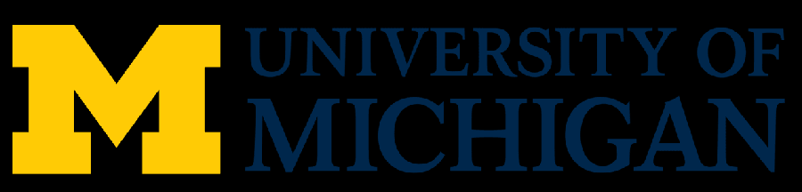
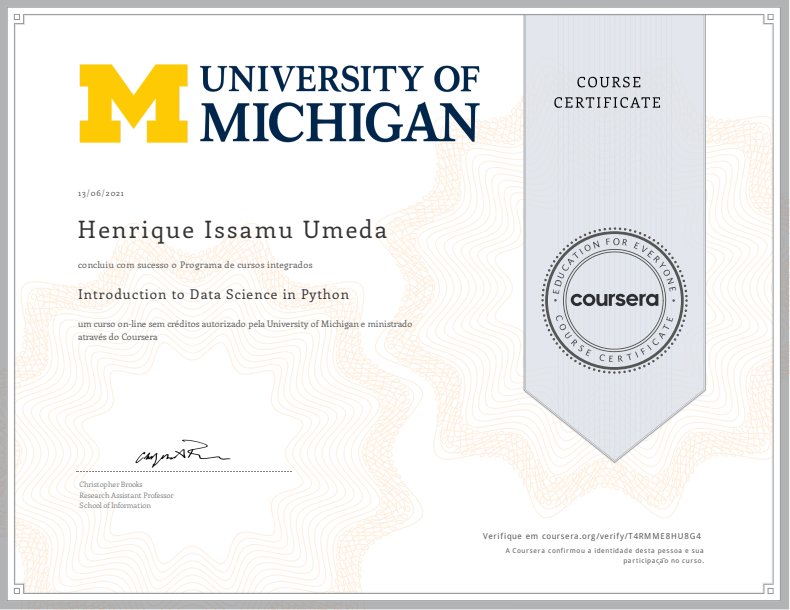

This is the repo in which I post my learning journey in Introduction to Data Science in Python course, provided by University of Michigan.

# Learning Journey
- Understand techniques such as lambdas and manipulating csv files
- Describe common Python functionality and features used for data science
- Query DataFrame structures for cleaning and processing
- Explain distributions, sampling, and t-tests

# Repository
- Notebooks - The folder with notebooks that show all the processes I took during classes
- csv - The folder with all csv files used during classes
- txt - The folder with all txt files used during classes
- images - The folder with all images used during classes and in the repo Readme
- assignments - The folder with all files used in the week assignments resolutions

# Stack 
- Pandas
- Numpy
- RE (Regular Expressions)

# Certificate 
The course was successfully concluded on 13/06/2021.

