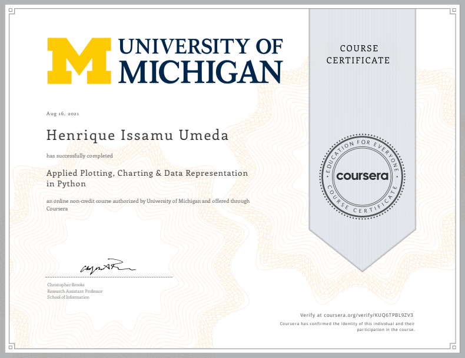

This is the repo in which I post my learning journey in Applied Plotting, Charting & Data Representation in Python course, provided by University of Michigan.

# Learning Journey
- Describe what makes a good or bad visualization
- Understand best practices for creating basic charts
- Identify the functions that are best for particular problems
- Create a visualization using matplotlb

# Repository
- Notebooks - The folder with notebooks that show all the processes I took during classes
- images - The folder with all images used during classes and in the repo Readme
- assignments - The folder with all files used in the week assignments resolutions

# Stack 
- Pandas
- Numpy
- Regex
- Matplotlib
- Seaborn

# Project
- In this course, a data visualization project was developed about the evolution of racial diversity of workers in São Paulo's municipal education system.
- [Racial Diversity in São Paulo's Municipal Education System](https://github.com/henriqueumeda/Data-Science-study/tree/main/UM/02%20-%20Applied%20Plotting%2C%20Charting%20%26%20Data%20Representation%20in%20Python/assignments/assignment4)

# Certificate 
The course was successfully concluded on 16/08/2021.

