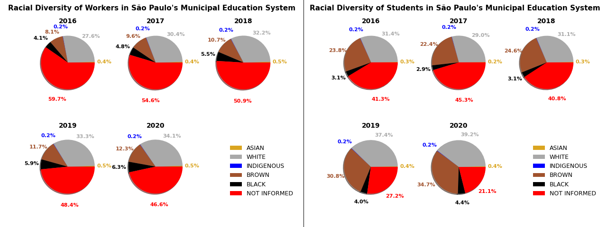

This is the repo of the final project of the Applied Plotting, Charting & Data Representation in Python course, provided by University of Michigan.

# Project:
- This project was created to answer the following question: 'Is racial diversity increasing among students and workers in São Paulo's Municipal Education System?'
- The matplotlib stack was used to quickly shows the reader the answer of the question, based on [Alberto Cairo's principles for good data visualization](https://towardsdatascience.com/data-visualization-and-truthful-art-324b13a2ad34).

  

# Repository :
- data - The folder with all datasets used to create the charts
- images - The folder with all images created in the project

# Stack 
- Pandas
- Numpy
- Regex
- Matplotlib
