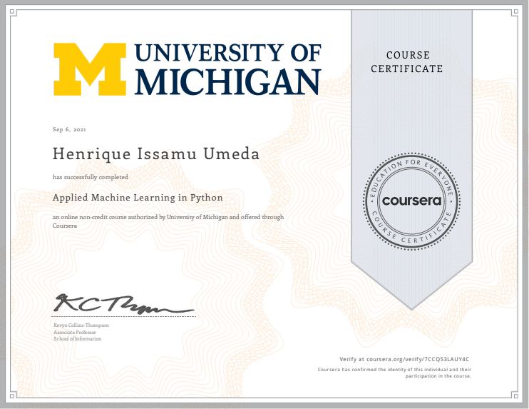

This is the repo in which I post my learning journey in Applied Machine Learning in Python course, provided by University of Michigan.

# Learning Journey
- Describe how machine learning is different than descriptive statistics
- Create and evaluate data clusters
- Explain different approaches for creating predictive models
- Build features that meet analysis needs

# Repository
- Notebooks - The folder with notebooks that show all the processes I took during classes
- csv - The folder with all csv files used during classes
- txt - The folder with all txt files used during classes
- images - The folder with all images used during classes and in the repo Readme
- assignments - The folder with all files used in the week assignments resolutions

# Stack 
- Pandas
- Numpy
- Regex
- Matplotlib
- Scikit-Learn
  - Supervised Learning
    - KNN
    - Linear Regression
    - Logistic Regression
    - SVM
    - Decision Trees
    - Naive Bayes
    - Random Forest
    - Gradient Boosted Decision Trees
    - MLP
  - Unsupervised Learning
    - PCA
    - MDS
    - TSNE
    - K-Means
    - Agglomerative Clustering
    - DBSCAN
  - Evaluation
    - Confusion Matrices
    - Decision Functions
    - Precision Recall Curves
    - ROC Curves
    - AUC

# Project
- In this course, a project to predict whether a given blight ticket, issued by the city to individuals who allow their properties to remain in a deteriorated condition, will be paid on time.
- [Understanding and Predicting Property Maintenance Fines](https://github.com/henriqueumeda/Data-Science-study/tree/main/UM/03%20-%20Applied%20Machine%20Learning%20in%20Python/assignments/assignment4)

# Certificate 
The course was successfully concluded on 06/09/2021.

