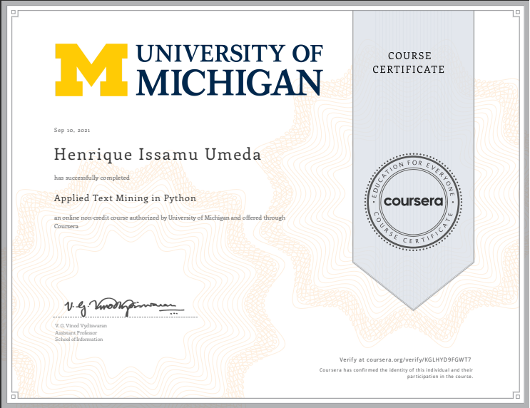

This is the repo in which I post my learning journey in Applied Text Mining in Python course, provided by University of Michigan.

# Learning Journey
- Understand how text is handled in Python
- Apply basic natural language processing methods
- Write code that groups documents by topic
- Describe the nltk framework for manipulating text

# Repository
- Notebooks - The folder with notebooks that show all the processes I took during classes
- csv - The folder with all csv files used during classes
- txt - The folder with all txt files used during classes
- images - The folder with all images used during classes and in the repo Readme
- assignments - The folder with all files used in the week assignments resolutions

# Stack 
- Pandas
- Numpy
- Regex
- Matplotlib
- Scikit-Learn
- NLTK

# Certificate 
The course was successfully concluded on 10/09/2021.

