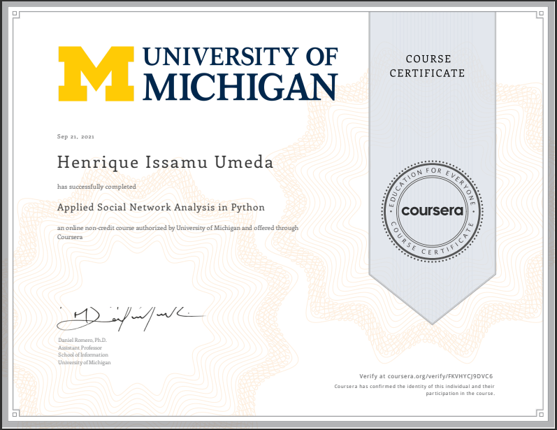

This is the repo in which I post my learning journey in Applied Social Network Analysis in Python course, provided by University of Michigan.

# Learning Journey
- Represent and manipulate networked data using the NetworkX library
- Analyze the connectivity of a network
- Measure the importance or centrality of a node in a network
- Predict the evolution of networks over time

# Repository
- Notebooks - The folder with notebooks that show all the processes I took during classes
- csv - The folder with all csv files used during classes
- txt - The folder with all txt files used during classes
- images - The folder with all images used during classes and in the repo Readme
- assignments - The folder with all files used in the week assignments resolutions

# Stack 
- Pandas
- Numpy
- Matplotlib
- Seaborn
- Scikit-Learn
- Networkx

# Certificate 
The course was successfully concluded on 21/09/2021.

