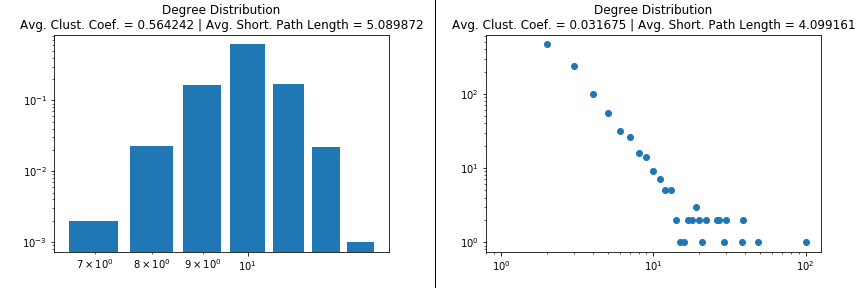

This is the repo of the final project of the Applied Social Network Analysis in Python course, provided by University of Michigan.

# Project
- This project was created to practice the identification of a random and graph (Part 1) and to predict the probability of employees in a company receiving a management position salary and the possibility of new connections between employees being made (Part 2).

## Part 1
- For each of the given Random Graphs, bar and scatter plots were created with the respectives average clustering coeficient and average shortest path length to identify if the Graph was generated by one of the three algorithms below:
  - Preferential Attachment ('PA')
  - Small World with low probability of rewiring ('SW_L')
  - Small World with high probability of rewiring ('SW_H')
 

  

---

## Part 2
- For each of the predictions, different Machine Learning methods were trained and tested, using the ROC AUC score as a evaluation parameter.
- For both predictions, the Logistic Regression model presented the best result and was used.

  Management Salary Prediction: LogisticRegression Cross-validation AUC = 0.919349371693
   
  Future Connections Prediction: LogisticRegression Cross-validation AUC = 0.90548466585
 

# Stack 
- Pandas
- Numpy
- Matplotlib
- Scikit-Learn
- Networkx
