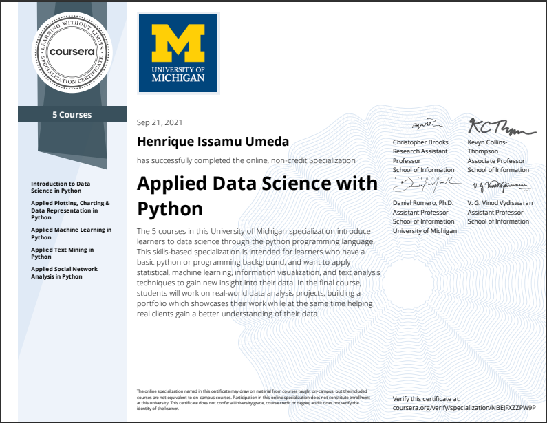

This is the repo in which I post my learning jorney in the Applied Data Science with Python Specialization from University of Michigan.

# Learning Journey
- Conduct an inferential statistical analysis
- Discern whether a data visualization is good or bad
- Enhance a data analysis with applied machine learning
- Analyze the connectivity of a social network

# Courses

 - [Introduction to Data Science in Python](https://github.com/henriqueumeda/Data-Science-study/tree/main/UM/01%20-%20Introduction%20to%20Data%20Science%20in%20Python)
 - [Applied Plotting, Charting & Data Representation in Python](https://github.com/henriqueumeda/Data-Science-study/tree/main/UM/02%20-%20Applied%20Plotting%2C%20Charting%20%26%20Data%20Representation%20in%20Python)
 - [Applied Machine Learning in Python](https://github.com/henriqueumeda/Data-Science-study/tree/main/UM/03%20-%20Applied%20Machine%20Learning%20in%20Python)
 - [Applied Text Mining in Python](https://github.com/henriqueumeda/Data-Science-study/tree/main/UM/04%20-%20Applied%20Text%20Mining%20in%20Python)
 - [Applied Social Network Analysis in Python](https://github.com/henriqueumeda/Data-Science-study/tree/main/UM/05%20-%20Applied%20Social%20Network%20Analysis%20in%20Python)

# Certificate 
The specialization was successfully concluded on 21/09/2021.

