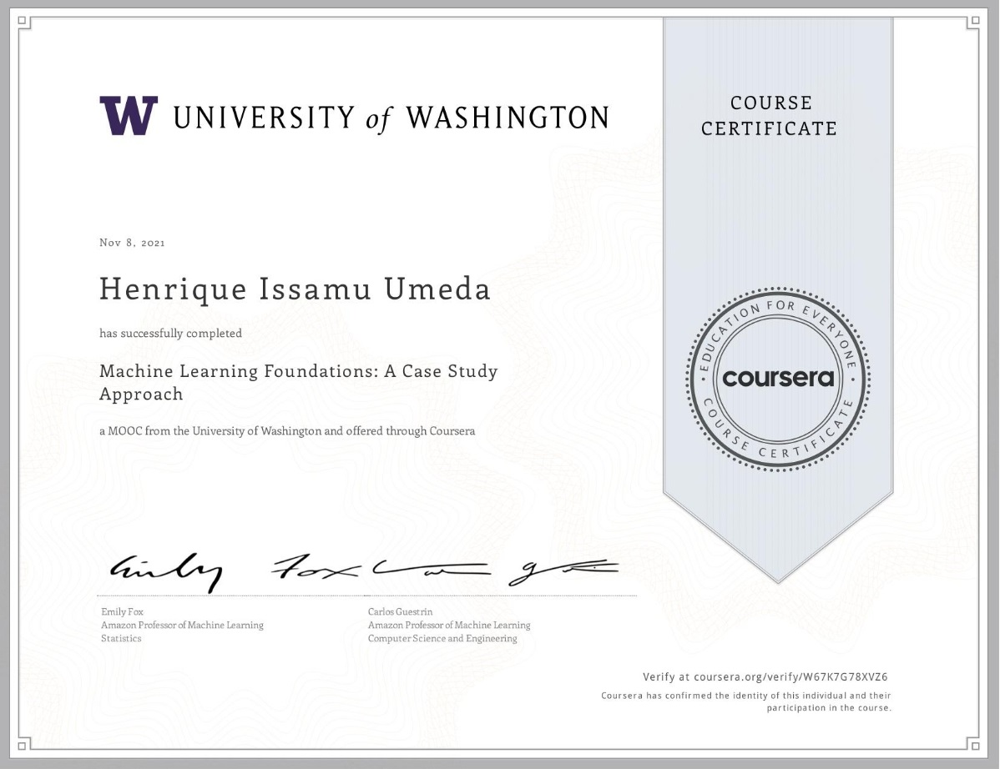

This is the repo in which I post my learning journey in Machine Learning Foundations: A Case Study Approach course, provided by University of Washington.

# Learning Journey
- Identify potential applications of machine learning in practice.  
- Describe the core differences in analyses enabled by regression, classification, and clustering.
- Select the appropriate machine learning task for a potential application.  
- Apply regression, classification, clustering, retrieval, recommender systems, and deep learning.
- Represent your data as features to serve as input to machine learning models. 
- Assess the model quality in terms of relevant error metrics for each task.
- Utilize a dataset to fit a model to analyze new data.
- Build an end-to-end application that uses machine learning at its core.  
- Implement these techniques in Python.

# Repository
- Notebooks - The folder with notebooks that show all the processes I took during classes
- Week * - The folders of all files of the corresponding week
- pdf - The folder with all pdfs of classes

# Stack 
- TuriCreate
- Matplotlib

# Certificate 
The course was successfully concluded on 08/11/2021.

